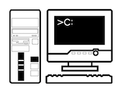
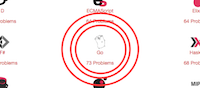
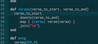

# Contributing to Exercism.io

First of all, **thank you** for helping with Exercism.io!

We are working to improve this document, and if you find any part of it confusing, or if you can't figure out how to get started with something, then rest assured it's not you, it's us! Please open up a new issue to describe what you were hoping to contribute with, and what you're wondering about, and we'll figure out together how to improve the documentation.

----

# Finding Your Way

| [I see a problem](#i-see-a-problem) | [I have an idea](#i-have-an-idea) | [I would like to help](#i-would-like-to-help) |
|:---:|:---:|:---:|
| |  |  |

----

## I see a problem

| [on the website](#i-see-a-problem-on-the-website) | [with the command-line client (CLI)](#i-see-a-problem-with-the-command-line-client-cli) | [getting started with a language](#i-see-a-problem-getting-started-with-a-language) | [with a specific exercise](#i-see-a-problem-with-a-specific-exercise) |
|:---:|:---:|:---:|:---:|
| |  |  |  |

### I see a problem on the website

* If you're having trouble figuring out how to do something on the website, jump in the [online support chat](https://gitter.im/exercism/support) and ask there.
- Check [`exercism/exercism.io`](https://github.com/exercism/exercism.io/issues?q=is%3Aissue+is%3Aopen+label%3Abug)'s repo for bugs; and while we might know there's an issue, any additional details sometimes can help.
- If the website has a bug, you can help by [filing a bug report](docs/filing-a-bug-report.md) in the [`exercism/exercism.io` repository](https://github.com/exercism/exercism.io/issues/new).
  - if you have the time and the desire, you can help *even more* by [fixing it](#i-would-like-to-help-i-know--want-to-get-better-at-web-programming).

### I see a problem with the command-line client (CLI)

* If you're having trouble installing or working with the CLI, ask for help in our [online support chat](https://gitter.im/exercism/support).
- It may be a reported/known bug; check [`exercism/cli`](https://github.com/exercism/cli/issues?q=is%3Aissue+is%3Aopen+label%3Abug)'s repo for bugs.
- If the CLI has a bug, you can help by [filing a bug report](docs/filing-a-bug-report.md) in the [`exercism/cli` repository](https://github.com/exercism/cli/issues/new).
  - if you have the time and the desire, you can help *even more* by [fixing it](#i-would-like-to-help-i-know--want-to-get-better-at-go).

### I see a problem getting started with a language

* If you're having trouble with the setup instructions, ask for help in our [online support chat](https://gitter.im/exercism/support).
- If you see a problem with the setup instructions, you can help by [filing a bug report](docs/filing-a-bug-report.md) in the "Issues" section of the [corresponding language repository](http://exercism.io/repositories).
  - if you have the time and the desire, you can help *even more* by [fixing it](#i-would-like-to-help-i-can--want-to-get-better-at-organizing-stuff).

### I see a problem with a specific exercise

* If a particular exercise is giving you grief, ask for help in our [online support chat](https://gitter.im/exercism/support).
- If there's a defect in the...
  - **instructions** of the exercise, you can make a difference by [filing a bug report](docs/filing-a-bug-report.md) in the [`exercism/x-common` repository](https://github.com/exercism/x-common/issues/new).
    - if you have the time and the desire, you can help *even more* by [fixing it](#i-would-like-to-help-i-can--want-to-get-better-at-organizing-stuff).
  - **tests** or **starter code** of the exercise, you can help by [filing a bug report](docs/filing-a-bug-report.md) in the "Issues" section of the [corresponding language repository](http://exercism.io/repositories).
    - if you have the time and the desire, you can help *even more* by [fixing it](#i-would-like-to-help-i-am-fluent-in--want-to-get-better-at-a-particular-programming-language).
- You can ask for help within the track:
  1. `exercism submit` the code you have;
  -  Follow the link that the CLI returns to view your new submission on the website;
  -  In the "**Manage**" pull-down (top-right), select "**Request Help**".

  When you do this, your submission is highlighted, letting others know you're stuck.

----

## I have an idea

| [making the website better](#i-have-an-idea-about-making-the-website-better) | [improving the command-line client (CLI)](#i-have-an-idea-about-improving-the-command-line-client-cli) | [a brand-new exercise for Exercism](#i-have-an-idea-about-a-brand-new-exercise-for-exercism) | [improving an existing exercise](#i-have-an-idea-about-improving-an-existing-exercise) |
|:---:|:---:|:---:|:---:|
| |  |  |  |

### I have an idea about making the website better

Is it around a portion of the site we're currently talking about?  Jump in!

Current specific discussions:

* User experience: [`exercism/discussions#34`](https://github.com/exercism/discussions/issues/34),
- solutions page: [`exercism/discussions#32`](https://github.com/exercism/discussions/issues/32),

Here are some helpful starter searches in the two repositories that contain ideas about the website:

* the home page: [`exercism/discussions?homepage`](https://github.com/exercism/discussions/issues?q=is%3Aissue+is%3Aopen+homepage+sort%3Aupdated-desc) / [`exercism/exercism.io?homepage`](https://github.com/exercism/exercism.io/issues?utf8=%E2%9C%93&q=is%3Aissue%20is%3Aopen%20homepage+sort%3Aupdated-desc),
- user's dashboard: [`exercism/discussions?dashboard`](https://github.com/exercism/discussions/issues?q=is%3Aissue+is%3Aopen+dashboard+sort%3Aupdated-desc) / [`exercism/exercism.io?dashboard`](https://github.com/exercism/exercism.io/issues?utf8=%E2%9C%93&q=is%3Aissue%20is%3Aopen%20dashboard%20+sort%3Aupdated-desc),
- user's profile page: [`exercism/discussions?profile`](https://github.com/exercism/discussions/issues?q=is%3Aissue+is%3Aopen+profile+sort%3Aupdated-desc) / [`exercism/exercism.io?profile`](https://github.com/exercism/exercism.io/issues?utf8=%E2%9C%93&q=is%3Aissue%20is%3Aopen%20profile%20+sort%3Aupdated-desc),
- user's account page: [`exercism/discussions?account`](https://github.com/exercism/discussions/issues?q=is%3Aissue+is%3Aopen+account+sort%3Aupdated-desc) / [`exercism/exercism.io?account`](https://github.com/exercism/exercism.io/issues?q=is%3Aissue+is%3Aopen+account+sort%3Aupdated-desc).

If the idea doesn't fit in one of those discussions, then if it relates to:

* a specific part of the site, start a new conversation in the [`exercism/exercism.io` repository](https://github.com/exercism/exercism.io/issues/new).
- multiple aspects of the site, kick it off in the [`exercism/discussions` repository](https://github.com/exercism/discussions/issues/new).

### I have an idea about improving the command-line client (CLI)

Current specific discussions:

* Overall user experience with the CLI: [`exercism/discussions#35`](https://github.com/exercism/discussions/issues/35).

Here are some helpful starter searches in the two repositories that contain ideas about the CLI:

* [`exercism/cli?`](https://github.com/exercism/cli/issues?q=is%3Aissue+is%3Aopen+sort%3Aupdated-desc)
- [`exercism/discussions?cli`](https://github.com/exercism/discussions/issues?q=is%3Aissue+is%3Aopen+cli+sort%3Aupdated-desc)

If the idea isn't being discussed yet, kick it off in the [`exercism/cli` repository](https://github.com/exercism/cli/issues/new).

### I have an idea about a brand-new exercise for Exercism

New exercise ideas are definitely welcome!  Here's how to ensure the idea lands in the right place:

*Note: the central library of exercises on Exercism is https://github.com/exercism/x-common.*

- Check to see if the exercise is listed: https://github.com/exercism/x-common/tree/master/exercises.
  - If it is there, but not in the language you'd like to solve it in, put in a request in that particular language's repository: http://exercism.io/repositories.
    - if you have the time and the desire, you can help *even more* by [implementing it](#-fluency-in-a-particular-programming-language).
  - If it is not there, suggest it in [`exercism/x-common`](https://github.com/exercism/x-common/issues/new).
    - if you have the time and the desire, you can help *even more* by [implementing it](https://github.com/exercism/x-common/blob/master/CONTRIBUTING.md#implementing-a-completely-new-exercise).
- If you know of a good source of potential new problems, please share: [`exercism/x-common#107`](https://github.com/exercism/x-common/issues/107).

### I have an idea about improving an existing exercise

- If the idea is to improve the...
  - **instructions** of the exercise, you can make a difference by making the suggestion in the [`exercism/x-common` repository](https://github.com/exercism/x-common/issues/new).
    - if you have the time and the desire, you can help *even more* by [fixing it](#i-would-like-to-help-i-can--want-to-get-better-at-organizing-stuff).
  - **tests** or **starter code** of the exercise, you can help by making the suggestion in the "Issues" section of the [corresponding language repository](http://exercism.io/repositories).
    -  if you have the time and the desire, you can help *even more* by [fixing it](#i-would-like-to-help-i-am-fluent-in--want-to-get-better-at-a-particular-programming-language).

----

## I would like to help

Thank you!

You have (or want to improve your) skills in

| [technical writing and organization](#i-would-like-to-help-i-can--want-to-get-better-at-technical-writing-and-organization) | [fluency in a particular programming language](#i-would-like-to-help-i-am-fluent-in--want-to-get-better-at-a-particular-programming-language) | [web programming](#i-would-like-to-help-i-know--want-to-get-better-at-web-programming) | [Ruby](#i-would-like-to-help-i-know--want-to-get-better-at-ruby) | [Go](#i-would-like-to-help-i-know--want-to-get-better-at-go) | [web design](#i-would-like-to-help-i-know--want-to-get-better-at-web-design) | [mentoring others](#i-would-like-to-help-i-know--want-to-get-better-at-mentoring-others)
|:---:|:---:|:---:|:---:|:---:|:---:|:---:|
|  |  |  |  |  |  | 

### I would like to help; I can / want to get better at technical writing and organization

- Find discussions about ways we'd like to improve our documentation: [`exercism/discussions?documentation`](https://github.com/exercism/discussions/issues?q=is%3Aissue+is%3Aopen+documentation+sort%3Aupdated-desc)
- Help make the instructions of an exercise more clear, interesting and/or engaging by locating that exercise in [`exercism/x-common`](https://github.com/exercism/x-common/tree/master/exercises) and [Tweaking its README.md](https://github.com/exercism/x-common/blob/master/CONTRIBUTING.md#tweaking-a-readme).
- Issues across all of Exercism looking for help with documentation: [`exercism?documentation`](https://github.com/search?o=desc&p=1&q=org%3Aexercism+documentation+is%3Aissue&ref=searchresults&s=updated&state=open&type=Issues&utf8=%E2%9C%93)

### I would like to help; I am fluent in / want to get better at a particular programming language

Are you a language enthusiast?  Help other people fall in love with your language by...

#### Mentoring Others

- Give feedback on other's submissions in your [Activity Stream](http://exercism.io/inbox).
- Help others get unstuck in the [support chat](https://gitter.im/exercism/support).
- However you support others, aim to do it [The Exercism Way](docs/the-exercism-way.md).

#### Contributing to a Language Track

This means helping maintain the code of the exercises and supporting tooling for a particular language.

- Find a language you love or want to get to know better: http://exercism.io/repositories
- Orient yourself through our [Getting Involved in a Track] (docs/getting-involved-in-a-track.md) guide.

### I would like to help; I know / want to get better at web programming

Do you have/want to have chops in HTML+CSS+JavaScript/CoffeeScript and want to improve the feel and function of the Exercism website?

1. [Setup your local development environment](docs/setting-up-local-development.md).
-  Locate a feature/bug to work on:
   - [`exercism/exercism.io?label:good first patch`](https://github.com/exercism/exercism.io/issues?q=is%3Aissue+is%3Aopen+label%3A%22good+first+patch%22)
   - [`exercism/exercism.io?label:bug`](https://github.com/exercism/exercism.io/issues?q=is%3Aissue+is%3Aopen+label%3Abug)
-  Work the issue: [the contribution workflow](docs/the-contribution-workflow.md).

You may also find these helpful:

- [Architecture Overview of Exercism](docs/overview-architecture.md)

### I would like to help; I know / want to get better at Ruby

Do you have/want to have chops in Ruby or Sinatra and want to add to the website?

1. [Setup your local development environment](docs/setting-up-local-development.md).
-  Locate a feature/bug to work on:
   - [`exercism/exercism.io?label:good first patch`](https://github.com/exercism/exercism.io/issues?q=is%3Aissue+is%3Aopen+label%3A%22good+first+patch%22)
   - [`exercism/exercism.io?label:bug`](https://github.com/exercism/exercism.io/issues?q=is%3Aissue+is%3Aopen+label%3Abug)
-  Work the issue: [the contribution workflow](docs/the-contribution-workflow.md).

You may also find these helpful:

- [Architecture Overview of Exercism](docs/overview-architecture.md)

### I would like to help; I know / want to get better at Go

One of the more subtle but important parts of the Exercism experience is our CLI; it's written in Go.

1. Setup your local development environment for the CLI: [`exercism/cli`](https://github.com/exercism/cli).
-  Locate a feature/bug to work on: [`exercism/cli?`](https://github.com/exercism/cli/issues)
-  Work the issue: [the contribution workflow](docs/the-contribution-workflow.md).

You may also find these helpful:

- [Architecture Overview of Exercism](docs/overview-architecture.md)

### I would like to help; I know / want to get better at web design

Do you love making enticing user experiences?  Help us [rethink our user experience](https://github.com/exercism/discussions/issues/34) (UX)!

* the [profile](https://github.com/exercism/discussions/search?q=profile&state=open&type=Issues) or [account](https://github.com/exercism/discussions/search?q=account&state=open&type=Issues) pages.
- the [dashboard](https://github.com/exercism/discussions/search?q=dashboard&state=open&type=Issues).
- the [homepage](https://github.com/exercism/discussions/search?q=homepage&state=open&type=Issues).
- the [solutions page](https://github.com/exercism/discussions/issues/32).

### I would like to help; I know / want to get better at mentoring others

Do you like mentoring people?

* Hang out in the support chat [support chat](https://gitter.im/exercism/support), or
* submit an exercise so you can [give feedback to people who have submitted it, too](http://exercism.io/inbox).

----

# Table of Contents

* [Code of Conduct](#code-of-conduct)
* [The Ecosystem](#the-ecosystem)
* [Submitting Code Changes](#submitting-code-changes)
    - [Workflow](#workflow)
    - [Issues](#issues)
    - [Good First Patch](#good-first-patch)
    - [Style](#style-ruby)
    - [Pull Requests](#pull-requests)
* [Roadmap](#future-roadmap)

## Code of Conduct

Help us keep exercism welcoming. Please read and abide by the [Code of
  Conduct](https://github.com/exercism/exercism.io/blob/master/CODE_OF_CONDUCT.md).

## The Ecosystem

Exercism consists of two main parts:

- **the website** - where the conversations happen (this repository)
- **the command-line interface (CLI)** - to fetch exercises and submit solutions [exercism/cli](https://github.com/exercism/cli)

Behind the scenes we also have:

- **language tracks** - one repository per language [see list](https://github.com/exercism/x-api/tree/master/tracks)
- **problem metadata** - a shared repository for all languages [exercism/x-common](https://github.com/exercism/x-common)
- **the problems API** - serves the exercise data [exercism/x-api](https://github.com/exercism/x-api)
- **rikki- the robot** - provides automated feedback on certain exercises [exercism/rikki](https://github.com/exercism/rikki)

### Contributing

If you want to work on the exercism.io website codebase, then continue reading this guide.

To contribute to one of the language tracks, check out the [Language Track Guide](https://github.com/exercism/x-common/blob/master/CONTRIBUTING.md).

For details about working with the problems API, check out the [Problems API Guide](https://github.com/exercism/x-api/blob/master/CONTRIBUTING.md).

## Submitting Code Changes

These instructions should get you closer to getting a commit into the
repository.

See the [Setting up Local Development guide](docs/setting-up-local-development.md) for more information about how to run exercism.io locally.

### Git Workflow

1. Fork and clone.
1. Add the upstream exercism.io repository as a new remote to your clone.
   `git remote add upstream https://github.com/exercism/exercism.io.git`
1. Create a new branch
   `git checkout -b name-of-branch`
1. Commit and push as usual on your branch.
1. When you're ready to submit a pull request, rebase your branch onto
   the upstream master so that you can resolve any conflicts:
   `git fetch upstream && git rebase upstream/master`
   You may need to push with `--force` up to your branch after resolving conflicts.
1. When you've got everything solved, push up to your branch and send the pull request as usual.

### Issues

We keep track of everything around the repository using GitHub [issues](https://github.com/exercism/exercism.io/issues).

### Good First Patch

We're trying to label issues with "good first patch" if we think that these can be solved
without too much context about exercism.io's codebase or functionality. To find them, you
can do an [organization-wide search](https://github.com/search?utf8=%E2%9C%93&q=is%3Aopen+label%3A%22good+first+patch%22+user%3Aexercism).

### Labels

[TODO: explain the various labels as we settle on useful ones]

### Style (Ruby)

We have [Rubocop](https://github.com/bbatsov/rubocop) integrated.
It is based on the [Ruby Style Guide](https://github.com/bbatsov/ruby-style-guide).
Help keep us our code clean by following the style guide.
Run the command `rubocop` to check for any style violations before
submitting pull requests.

### Style (JS/CSS)

If you have any JS or CSS changes, please run `cd frontend && lineman spec-ci` to check for any style violations before submitting pull requests.

### Pull Requests

When submitting a pull request, sometimes we'll ask you to make changes before
we accept the patch.

Please do not close the first pull request and open a second one with these
changes. If you push more commits to a branch that you've opened a pull
request for, it automatically updates the pull request. This is also the case
if you change the history (rebase, squash, amend), and use git push --force to
update the branch on your fork. The pull request points to that branch, not to
specific commits.

## Future Roadmap

We focus our efforts on the [roadmap](docs/roadmap.md).

Sometimes we get suggestions for things that would be great, but they're not
part of locking down the core behavior of the app. In this case we'll close
and label it ["future roadmap"](https://github.com/exercism/exercism.io/labels/future%20roadmap)
to make it easy to search for later.

For more resources see:

* [Git Workflow](https://github.com/exercism/x-common/blob/master/CONTRIBUTING.md#git-basics) in the language track contributor guide
* [How to Squash Commits in a GitHub Pull Request](http://blog.steveklabnik.com/posts/2012-11-08-how-to-squash-commits-in-a-github-pull-request)
