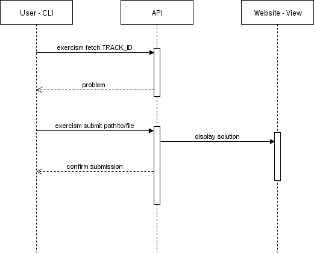

# Architecture of Exercism

Exercism is built with the [Sinatra](https://github.com/sinatra/sinatra) web framework.
If you haven't heard of it, definitely check it out. It's a lightweight web framework for Ruby.

Exercism kind of follows what some may call an MVP (Model-View-Presenter) architecture.
Read more about that [here](https://en.wikipedia.org/wiki/Model%E2%80%93view%E2%80%93presenter).

## Domain knowledge

We have developed some domain concepts in order to communicate effectively.
Check out the [glossary][], as this can help you gain a theoretical and practical understanding of Exercism.

Unfortunately, the exercism.io codebase is a jumble of old hacks and accreted scar tissue from four years of experimentation, so a lot of the
terms in the codebase do not match those that we've settled on.

E.g.:

- `UserExercise` refers to a _solution_
- `Submission` refers to an _iteration_
- `Problem` refers to a _specification_

## An Apology

OK. So, first off: we're sorry. Very, very sorry.

The exercism.io codebase is a disastrous mess. Not kidding.

This is not good code except in the sense that it let us learn important things.
Most of this codebase happened by accident as we experimented and started figuring out what Exercism was going to be.

Half the time, we don't even know where to look in the code. So if you're confused, rest assured: It's not you.

Now, the good news. There's pretty decent test coverage. That means that for the most part, if the tests still run once you've
changed things, then the site probably works.

## Overview

The system is broken into smaller components which represent different areas of concern.

The components that make up the exercism.io codebase are:

- the API (`./api`), HTTP endpoints that are used by (mostly) the command-line client
- the app (`./app`), HTTP endpoints, helpers, presenters, and views that together serve up the pages of the website
- application logic (`./lib`), mostly models but also some rake tasks in `lib/tasks`
- database stuff (`./db`), migrations and seed data
- tests (`./test`), the automated tests that verify the behavior of the app
- scripts (`./bin`, `./scripts`), various scripts that help us do stuff
- frontend (`./frontend`), the Sass (CSS) and JavaScript files that the site relies on
- static assets (`./public`)
- docs (`./docs`), documentation related to this codebase
- miscellaneous stuff (`./x`), a kitchen sink of experiments that we didn't want to throw in the `./lib` directory

### API

API contains routes which are used by the JavaScript frontend and the [CLI](https://github.com/exercism/cli).
The routes here are similar to the one's in `app/` in that they're individual Sinatra apps that inherit from the Core API route (`api/v1/routes/core.rb`).
If you add a route, it needs to be added to `api/v1/routes.rb` and `api/v1/v1.rb`.

### App (Routes, Presenters, Helpers and Views)

App is the user facing side of Exercism.
It handles logging in (and other functions), making calls out to the database to store or get information,
structuring HTML (that can later be styled), etc.

**Helpers** can be anything that *helps* presentation of data. For Exercism, these are things like:
wrappers for Markdown and Syntax Highlighting parsers, session handling, etc.
Helpers are defined in individual modules under `app/helpers/*`.
The full list of helpers is in `app/helpers.rb`, and if you add a new helper, this file needs to be edited.
The convention is `ClassName: 'filename'`.

**Presenters** are for showing information that would be beneficial to users or the views but maybe not the best way to store data.
For example, in Exercism, most times are stored in UTC (generally most servers store time this way) but... users might want to see times in their own timezone.
Presenters can take relevant information (like showing comment notifications on the dashboard) and transform it to be more personal.
This convention hasn't been strictly enforced so that description varies between presenters.
Presenters are defined in individual classes/modules under `app/presenters/*`.
The presenters are loaded into the app in the `app/presenters.rb` file, and if you add a presenter, it needs to be added to that file.
The convention is `ClassName: 'filename'`.

**Routes** in Sinatra are kind of like a combination of routes and controllers in Rails.
Each route file contains an individual Sinatra app that inherits some behavior from `Core` (found in `app/routes/core.rb`).
In a route file, you can specify endpoints (like `exercism.io/login`) and define how the app should respond (i.e. accept some credentials and log the user in or handle errors accordingly).
Routes are defined in individual modules under `app/routes/*`.
The route files are loaded into the app with the `app/routes.rb` file, and if you add a route file, it needs to be added to that file.
The convention is `ClassName: 'filename'`.
Routes are unique in that you'll also have to update the main `app.rb` with the new app info.
The convention is `Routes::ClassName`.

**Views** are a collection of templates that create html.
Templates are a way to embed Ruby in your views so that you can serve up information,
iterate over items without repeating yourself (like creating tables of data), etc.
The templating engine that Exercism uses is [ERB](https://en.wikipedia.org/wiki/ERuby).

### Frontend (JavaScript, Custom Directives, Bootstrap, etc)

The client side is mostly written in CoffeeScript and uses frameworks like angular and bootstrap.

**Frontend** is where Exercism stores all of it's production client side code.
Exercism doesn't have much JS (outside of bootstrap) but `frontend/` does handle comment threads on submissions, markdown preview on comments, submission code (expanding and contracting), etc. If you suspect that there is frontend wizardry happening and you haven't seen it in bootstrap, most likely it's in here.

### DB (Migrations)

To create a migration you can use `rake db:generate:migration name=the_name_of_your_migration`.
That will create a new migration in `db/migrate`.
For help, look at the other migrations or at docs for ActiveRecord migrations.
If you add, remove or rename database columns, you may have to update the seeds as well.
Exercism pulls seed data from another repo found [here](https://github.com/exercism/seeds).
The seed data provides placeholder information (like users, exercise submissions, comments, etc) to help with development.

### Lib (DB Configurations, Application Logic, Models, Rake Tasks)

**Application Logic** can be anything that is used for the backend application (and, possibly, shared with the frontend as well) can live here.
Maybe a library for GitHub OAuth, configurations for a Markdown parser and a syntax highlighter, etc.

**Models** are for connecting classes (e.g. `User`) and their attributes to database tables with ActiveRecord (ones that you set up with migrations), relating them to other tables (e.g. `User` `has_many :posts`) and adding other type functionality (e.g. validations).

### Test

Tests follow the organization of the app. For instance, if you're writing a new route, it would go in `test/app`. You could write a test post or get and assert that you get back data that you expect. Read more about tests [here](#test-order).

## Additional Directories

#### Bin (Tools)

**Console** provides a REPL (Read-Eval-Print-Loop) with the Exercism application logic pre-loaded.
Want to see what it would look like to be a user that has done every exercise? Console.
Want to test out a new feature but you haven't written the frontend for it? Console.
A bit more info can be found [here](#console).

**Setup** is a script that you can run in order to create the development and test databases, makes sure all the apps dependencies (gems) are installed, etc.

### Config

Database connection, bugsnag config and local development GitHub OAuth credentials.

### Docs (Static Files for GitHub Docs)

Static files and pictures for hosting in the GitHub docs.

### Public (Static Files for the Site)

Static files for the Exercism web app. Fonts, jQuery (`public/js/app.js`), icons, language images, and sass (styling).

### X

X is a collection of scripts to organize and compile documentation for the many parts of exercism (cli, general help, product introduction, track info).

[glossary]: https://github.com/exercism/docs/blob/master/glossary.md
